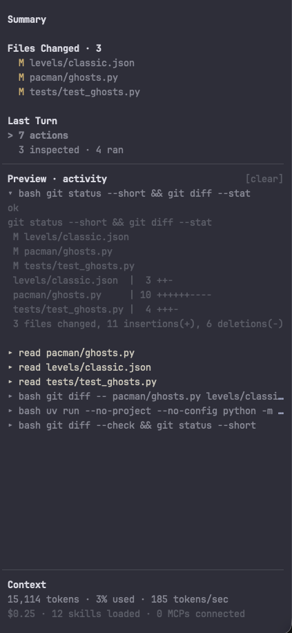
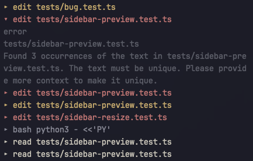

# pi-slate

A minimal terminal UI/UX for [Pi](https://pi.dev), with a customizable sidebar that keeps your work in view. 


## Setup

**Option 1: Copy-paste this into your Pi agent**:

```
- Save my pi-agent's tui and themes. Safely disable them for now. 
- install pi-slate to my local pi agent using:  `pi install git:github.com/GaganSD/pi-slate`
- Enable fullscreen mode. Slate replaces Pi's existing TUI; Existing state and replace with Slate/conflicts. Ask me to /reload session once complete. 
- For any existing replaced tui, list top 3 suggestions to integrate those into pi-slate. 
```

**Option 2: copy-paste this in your bash**
```bash
pi install git:github.com/GaganSD/pi-slate
pi --tui-mode fullscreen
```

Explore extension settings using `/slate` command after installation.

## Features

Slate cleanly renders into your terminal and is easily customizable in your pi. It adds no additional context bloat to your model.

### Rich Media Display In Your Terminal

Slate uses Kitty Graphics Protocol to display rich media inside your terminal. Caret-Peek over text to display. Click Preview to copy-path. Double-click to open/edit. Also supports Pi-generated clipboard image paths into `[image-N]` tokens.

<p align="center">
  
</p>

### Observability

1. **Get Work-tree observability**. Click to Preview in terminal. Double-Click to Open in editor. Use the mouse wheel to scroll.

<p align="center">
  
</p>

2. **Last-Turn Observability.** Tracks activity for the latest user request. Click a count or category to inspect its activity, then click an activity title in Preview to expand or collapse the tool details. Use **[clear]** to dismiss the selected preview.

<p align="center">
  
</p>

## **Session Context Overview**

- keeps usage and spend visible at the bottom. Context usage may be estimated when provider usage is unavailable.

<p align="center">
  
</p>

## Commands

`/slate` with no args opens the same settings picker.

| Setting | Commands | Effect |
| --- | --- | --- |
| Sidebar width | `/slate width [default\|narrow\|medium\|wide\|<percent>]` | How wide the sidebar is. `default` is 20%. |
| Message length | `/slate message-length [default\|all\|<count>]` | How many chat messages stay on screen. `default` is 100. |
| Density | `/slate density [comfortable\|compact]` | Comfortable pads the editor; compact does not. |
| Footer | `/slate footer [standard\|minimal]` | Standard shows model and thinking when there is room; minimal hides them. |
| Bugs | `/slate bug [file\|open]` | File a GitHub issue, or open the tracker. |

## Minimal by design

Slate adds no context bloat -- no tools, prompts, or model calls. It's entirely deterministic and made to be customizable and purely improves your interface and pi experience while your Pi remains yours.

## Requirements/limits
- Inline previews need Kitty or iTerm2 image-protocol support detected by Pi. Otherwise, previews fall back to text. Terminal multiplexers and proxies can affect detection.
- **Other UI extensions:** Slate replaces Pi's header, footer, and editor. Extensions that replace the same surfaces may conflict.
- File an issue for bug: [pi-slate](https://github.com/GaganSD/pi-slate/issues)

## License

Gagan Devagiri (GaganSD) - [MIT](LICENSE)
