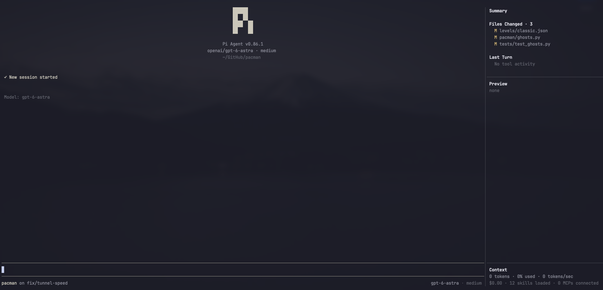
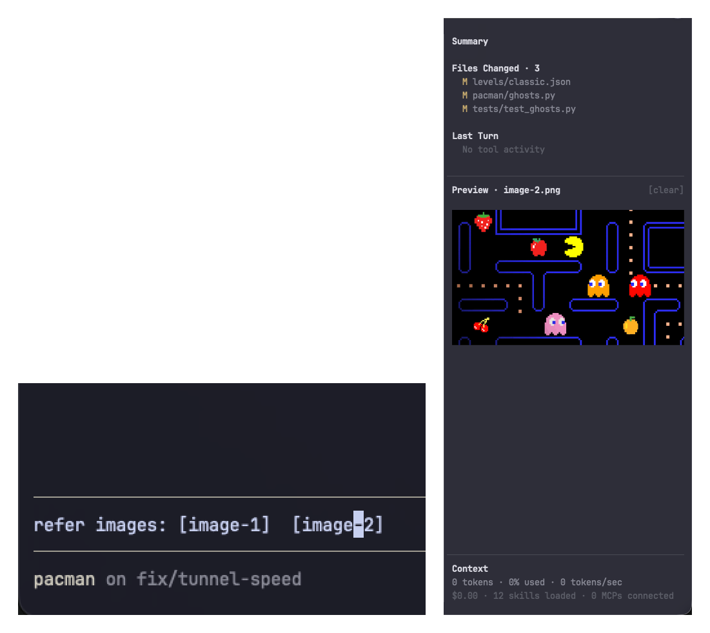
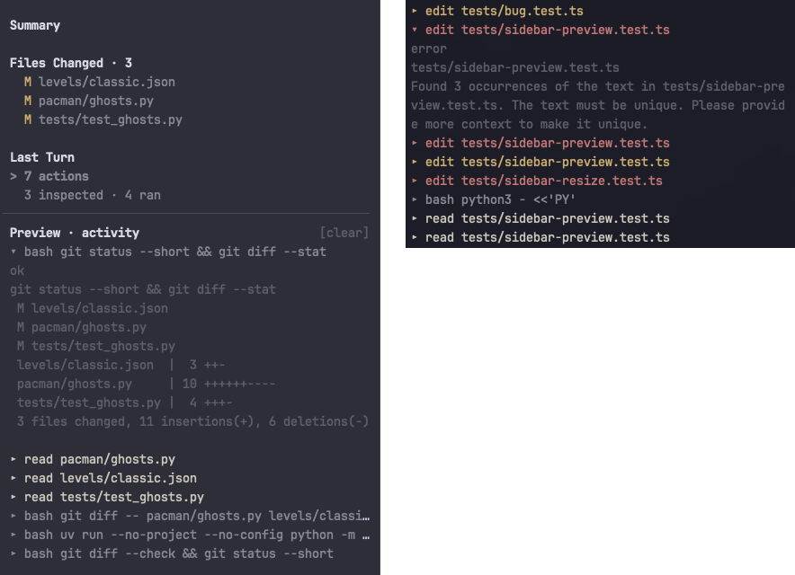
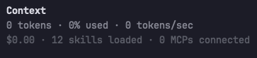

<h1 align="center">Slate 🌱</h1>

<p align="center">
  A minimal terminal UI/UX for Pi Coding Agent with a customizable sidebar that keeps your work in view.
  <div style="height: 20px;"></div>
  
</p>

## Setup

**Option 1: Copy-paste this into your Pi agent**

```
- Save my pi-agent's tui and themes. Safely disable them for now.
- Install pi-slate to my pi-agent using: `pi install git:github.com/GaganSD/pi-slate`
- Enable fullscreen mode. Slate replaces Pi's existing TUI; resolve any conflicts. Ask me to /reload session once complete.
- For any existing replaced tui, list top 3 suggestions to integrate into pi-slate.
```

**Option 2: Copy-paste this in your bash**

```bash
pi install git:github.com/GaganSD/pi-slate
pi --tui-mode fullscreen
```

Explore extension settings using `/slate` command after installation.

## Features

Slate cleanly renders into your terminal and is easily customizable in your Pi. It adds no additional context bloat to your model.

### Rich Media Rendering

Slate uses Kitty Graphics Protocol to display rich media inside your terminal.

> Usage: Caret-Peek over text to display. Click Preview to copy-path. Double-click to open/edit. Also supports Pi-generated clipboard image paths into `[image-N]` tokens.

<p align="center">
  
</p>

### Interactive Observability

Inspect work-tree files and recent request activity directly from the terminal.

> Usage: Single-click to preview files or drill into activity categories, double-click to open files in your editor, and expand activity entries to inspect detailed tool executions.

<p align="center">
  
</p>

### Session Context Overview

Slate keeps usage and spend visible at the bottom. Context usage may be estimated when provider usage is unavailable. Slate is fully deterministic and doesn't use your LLM.

<p align="center">
  
</p>

## Commands

`/slate` with no args opens the same settings picker.

| Setting | Commands | Effect |
| --- | --- | --- |
| Sidebar width | `/slate width [default\|narrow\|medium\|wide\|<percent>]` | How wide the sidebar is. `default` is 20%. |
| Message length | `/slate message-length [default\|all\|<count>]` | How many chat messages stay on screen. `default` is 100. |
| Density | `/slate density [comfortable\|compact]` | Comfortable pads the editor; compact does not. |
| Footer | `/slate footer [standard\|minimal]` | Standard shows model and thinking when there is room; minimal hides them. |
| Bugs | `/slate bug [file\|open]` | File a GitHub issue, or open the tracker. |

## Minimal By Design

Slate adds no context bloat; no tools, prompts, or model calls. It's entirely deterministic and made to be customizable and improve your Pi experience while your Pi remains yours.

## Requirements
- Pi Coding Agent and a Modern Terminal that can render Kitty or iTerm2 image-protocol. (Ghostty, Warp, etc.)
- Disable other UI extensions or ask your agent to merge them. Slate replaces Pi's header, footer, and editor. Extensions that replace the same surfaces may conflict.
- File an issue for a bug: [pi-slate](https://github.com/GaganSD/pi-slate/issues)

## License

GaganSD • [MIT](LICENSE)
